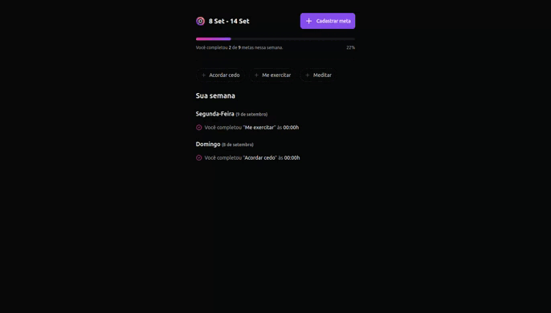
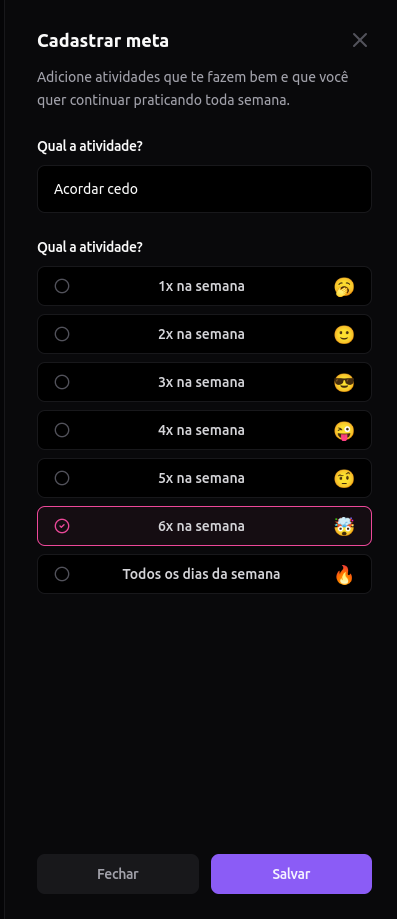
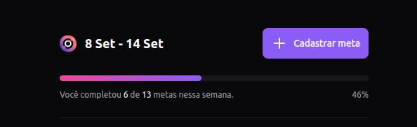
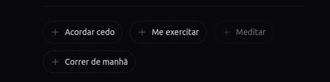
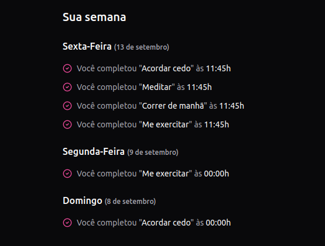

  

###

O **in.orbit** é uma aplicação fullstack desenvolvida para ajudar no **acompanhamento de metas diárias**. Com ele, você pode criar e gerenciar objetivos semanais, monitorando seu progresso de forma intuitiva e organizada. Eu desenvolvi esse projeto durante a maratona NLW da Rocketseat.

  

---

## Funcionalidades

- **Criação de metas**: Defina objetivos (ex: "Acordar cedo") e o período de cumprimento, que pode variar de 1 a 7 dias.

  

---

- **Acompanhamento semanal**: Visualize uma barra de progresso na tela principal, mostrando o número de metas definidas, quantas já foram concluídas e a porcentagem de tarefas concluídas na semana atual.

  

---

- **Conclusão de metas**: Cada meta tem um botão de ação. Ao clicar, você conclui uma etapa. Após atingir a quantidade necessária de vezes, a meta é finalizada e o botão fica desativado.

  

---

- **Histórico semanal**: Acompanhe um registro detalhado dos dias em que as metas foram concluídas, com uma lista exibindo o título e horário de conclusão de cada meta separadamente.

  

---

## Detalhes adicionais

- A interface exibe metas e progresso por **semana**, permitindo que você trabalhe exclusivamente com os objetivos da semana atual.
- Após concluir uma meta na semana, o sistema registra essa atividade no histórico, facilitando o acompanhamento de seu desempenho ao longo dos dias.

---

## Tecnologias Utilizadas

### Geral
- [TypeScript](https://www.typescriptlang.org/)
- [Zod](https://zod.dev/)
- [Day.js](https://day.js.org/)

### Banco de Dados
- [PostgreSQL](https://www.postgresql.org/)

### Backend
- [Node.js](https://nodejs.org/)
- [Fastify](https://www.fastify.io/)
- [Drizzle ORM](https://orm.drizzle.team/)

### Frontend
- [React](https://react.dev/)
- [TailwindCSS](https://tailwindcss.com/)
- [tailwind-merge](https://github.com/dcastil/tailwind-merge)
- [Tailwind Variants](https://tailwind-variants.org/)
- [Radix UI](https://www.radix-ui.com/)
- [React Hook Form](https://react-hook-form.com/)
- [React Query](https://tanstack.com/query/latest)
- [Lucide React](https://lucide.dev/)

### Ferramentas de Desenvolvimento
- [Docker](https://www.docker.com/)
- [Vite](https://vitejs.dev/)
- [BiomeJS](https://biomejs.dev/)

---

## Instalação e Execução

Este projeto é dividido em duas partes: **frontend** e **backend**. Para instruções detalhadas sobre como configurar e rodar cada parte, consulte os respectivos links abaixo:

- [Instruções para rodar o backend](./backend/README.md)
- [Instruções para rodar o frontend](./frontend/README.md)

---

## Futuras Implementações

- **Autenticação de Usuário**: Implementar um sistema de login e gerenciamento de usuários.
- **Integração com Google Calendar**: Adicionar lembretes de metas diretamente no Google Calendar.
- **Tela de Histórico Completo**: Desenvolver uma visualização completa das tarefas concluídas com filtros por data.
- **Filtro de Datas na Tela Principal**: Permitir a exibição de metas por períodos específicos, além da semana atual.
- **Restrição de Marcação Diária**: Implementar lógica para permitir a marcação de cada meta apenas uma vez por dia, respeitando o prazo mínimo.
- **Desfazer Tarefas**: Adicionar a funcionalidade de desfazer a marcação de tarefas feitas por engano.
- **Testes Frontend e Backend**: Implementar testes automatizados para garantir a qualidade do código.
- **Princípios SOLID e Design Patterns**: Aplicar princípios de design SOLID e padrões de projeto no backend.
- **Rotina de CI/CD**: Configurar pipelines de integração contínua e entrega contínua (CI/CD) para o projeto.
- **Versão Mobile**: Desenvolver uma versão mobile da aplicação para proporcionar uma melhor experiência em dispositivos móveis.
- **Substituição da Fetch API por Axios**: Trocar a Fetch API atualmente utilizada no Frontend para requisições HTTP para a biblioteca Axios para uma gestão de requisições mais robusta e simplificada.

---

## Contribuição

Contribuições são bem-vindas! Se você quiser sugerir melhorias, relatar bugs ou contribuir com código, siga estas etapas:

1. Faça um fork do repositório.
2. Crie uma branch com a nova funcionalidade ou correção de bug: `git checkout -b feature/nova-funcionalidade`.
3. Commit suas mudanças: `git commit -m 'Adiciona nova funcionalidade'`.
4. Envie para a branch original: `git push origin feature/nova-funcionalidade`.
5. Abra um Pull Request.

---

## Contato

Se você tiver dúvidas ou sugestões, entre em contato:

- Email: [eduardoa.fernandes@hotmail.com](mailto:eduardoa.fernandes@hotmail.com)
- LinkedIn: [Eduardo de Almeida Fernandes](https://linkedin.com/in/almeidaedu)

---

## Licença

Este projeto está licenciado sob os termos da [MIT License](./LICENSE).
